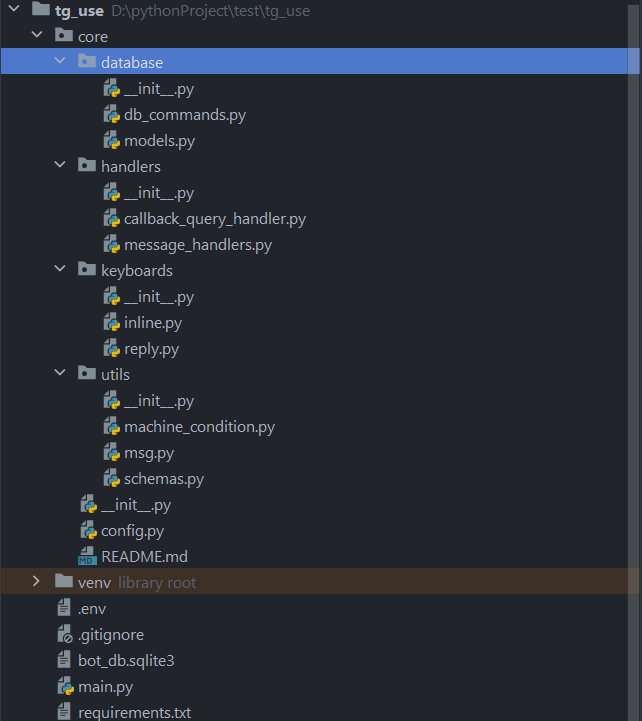

# tg-use
### tg-use bot for saving exam points


### Python version = 3.11

## Install packages

```shell
pip install requirements.txt
```

## Project structure
### 



- #### core - package containing the main logic
   - #### database - stores models DB and queries
   - #### handlers - stores  business logic
   - #### keyboards - stores keyboards
   - #### utils - stores utils
- #### env - stores secret data (cannot be sent 😢  )
- #### main - point of entry
